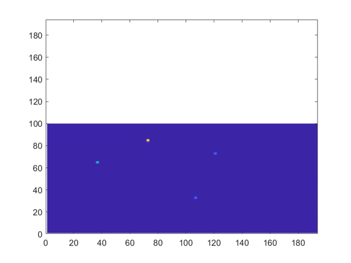

# Déchets & Pollution

## Principe :

Ce projet a pour but de simuler la diffusion d'un nuage de polluant dans une situation avec du vent. 
Le modèle de dispertion est basée sur la loi de Fick.

## Exemples de résultats : 

Avec 4 sites polluant émetteurs de particules fines PM10 :

